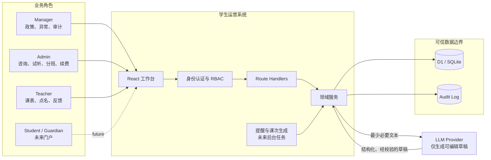
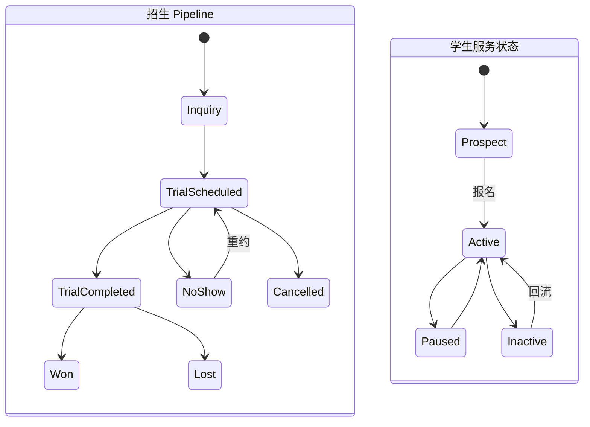
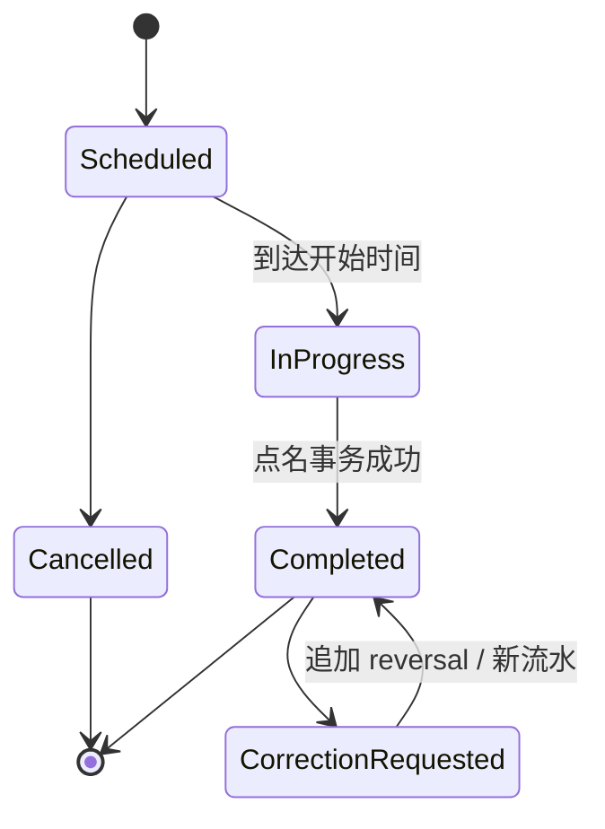
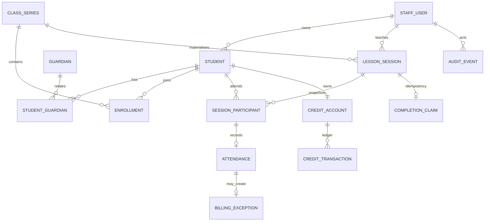
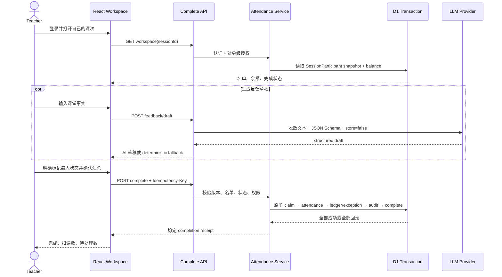

# Austin Education 学生运营系统架构

> 设计目标：在约 1,000 名学生、10 名 Admin、20 名老师、每周约 60 节课的规模下，优先保证业务事实、权限、课时账务和可恢复性。采用模块化单体而不是微服务；设计覆盖完整业务，代码只实现老师点名这一条垂直切片。

## 1. 系统上下文

### 信任边界

- 浏览器只提交意图，不提交可信的 role、teacherId、余额或扣课数量。
- Route Handler 完成认证与输入解析；领域服务执行授权、状态机和事务。
- 数据库通过 FK、CHECK、UNIQUE 和 trigger 兜底关键不变量。
- LLM 永不决定权限、排课、出勤或计费，也不在数据库事务内。

## 2. 模块化单体

| 模块 | 主要职责 | 核心实体 | 当前实现 |
|---|---|---|---:|
| Identity & Access | Staff 身份、角色、停用、对象级权限 | StaffUser, Role | ✅ |
| Acquisition | 咨询、试听、转化、流失原因 | Inquiry, TrialBooking, TrialOutcome | 设计 |
| Student CRM | 学生、Guardian、负责人和转交历史 | Student, Guardian, AdminAssignment | 部分 |
| Scheduling | 固定班、具体课次、代课、取消、冲突 | ClassSeries, LessonSession | 部分 |
| Enrollment | 入班、转班、暂停、生效区间、课次名单快照 | Enrollment, SessionParticipant | ✅ 切片 |
| Delivery | 出勤、课堂记录、反馈、纠错 | Attendance, Feedback | ✅ 切片 |
| Credits & Billing | 购买、消费、调整、冲销、异常处理 | CreditAccount, CreditTransaction, BillingException | ✅ 切片 |
| Follow-up | 试听跟进、续费任务、SLA、提醒 | FollowUpTask | 设计 |
| AI Assistance | 结构化草稿、校验、降级、生成审计 | AiGeneration | ✅ 切片 |
| Audit & Operations | 操作者、变更原因、对账、指标 | AuditEvent | 部分 |

模块共享一个关系数据库和一次部署，但通过领域服务边界隔离。当前规模下这比微服务更易保证事务和演示可解释性。

## 3. 角色与权限

| 操作 | Teacher | Admin | Manager | Guardian / Student |
|---|---:|---:|---:|---:|
| 查看自己的今日课次 | 自己 | 只读摘要 | 全部 | — |
| 查看课程名单 | 自己课次 | 负责学生／机构策略 | 全部 | 自己 |
| 完成点名 | 自己课次 | 不允许 | 异常代办 | — |
| 修改已完成点名 | 不允许 | 通过纠错流程 | 通过纠错流程 | — |
| 查看家长付款信息 | 不允许 | 按负责范围 | 全部 | 自己 |
| 安排试听／分班 | 不允许 | 自己负责学生 | 全部 | 申请 |
| 课时购买／调整／退款 | 不允许 | 受限 | 允许并审计 | 查看 |
| 处理零余额异常 | 查看结果 | 处理负责学生 | 处理全部 | 补购 |
| 转移学生负责人 | 不允许 | 申请／受限 | 允许并保留历史 | — |

角色只说明“能做什么”；学生 owner／课次 teacher 说明“能操作哪个对象”。两者必须同时满足。

## 4. 关键生命周期

招生状态和服务状态是两个正交维度，不能压进一个 `student.status`。

- `ClassSeries` 是每周规则；`LessonSession` 是某天实际发生的课。
- 课次形成时冻结 `SessionParticipant`，之后退班不会改写历史名单。
- 已完成出勤不直接 UPDATE；纠错追加冲销和新事实。

## 5. 数据关系

### 课时账本

| 类型 | 数量 | 规则 |
|---|---:|---|
| PURCHASE | `+n` | 购课产生，不覆盖旧余额 |
| ATTENDANCE | `-1` | 由唯一 Attendance source 产生 |
| ADJUSTMENT | `±n` | Manager/Admin，必须有原因 |
| REVERSAL | 与原流水相反 | 引用原流水，不修改或删除历史 |

余额由流水求和。若到课但余额不足，Attendance 仍保存，同时创建 `BillingException(open)`；处理后要么补购并扣课，要么豁免并记录原因。

## 6. 当前垂直切片链路

## 7. 异常与恢复原则

| 场景 | 行为 |
|---|---|
| 未登录／停用账号 | 401／403；前端提供重新登录 |
| 操作其他老师的课 | 403；零写入 |
| 名单变化或旧版本 | 409；保留草稿，刷新对比 |
| 重复请求 | 同 key + 同 payload 返回原 receipt；不同 payload 返回 409 |
| 余额不足 | 出勤保存、不开负账、创建 billing exception |
| 数据库 statement 失败 | 整个 transaction rollback |
| 网络结果未知 | 用同 key 查询／重试并与 receipt 对账 |
| LLM 未配置、超时、429、5xx、非法结构 | 返回本地 fallback，不影响点名 |
| 切换课次／刷新 | dirty guard + 每课次本地草稿恢复 |
| 已取消课次 | UI 只读，服务端 409 |

## 8. 扩展路径

1. **下一业务切片**：Admin 的试听安排与跟进队列。
2. **账务闭环**：购买、退款、课包有效期、BillingException 处理 UI。
3. **排课能力**：周期课生成、节假日、教室／老师／学生冲突和代课。
4. **家长门户**：只读余额、出勤和经审核的反馈。
5. **运营能力**：续费提醒、SLA、审计查询、对账任务和指标告警。
6. **规模变化时**：先加索引、队列和只读副本；只有明确独立扩缩容需求时才拆服务。
