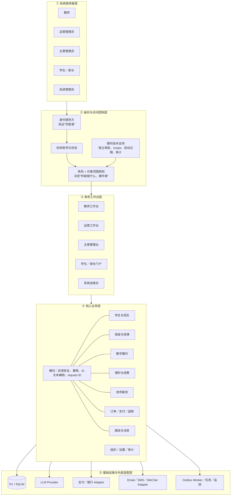
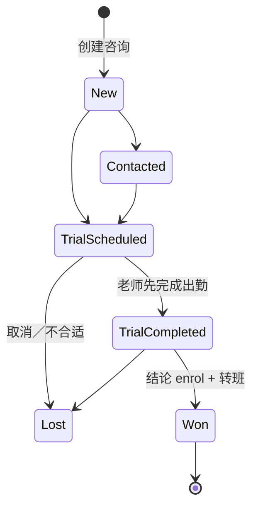
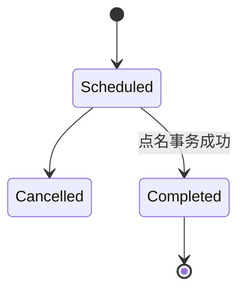
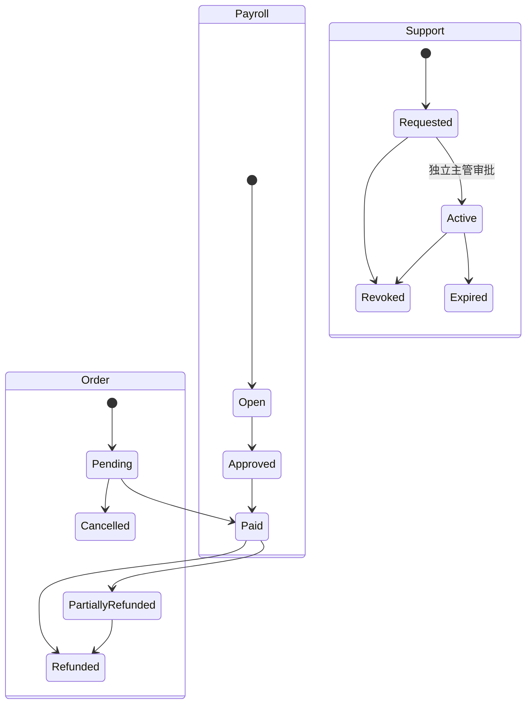
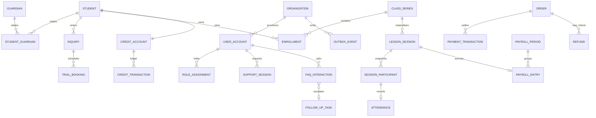
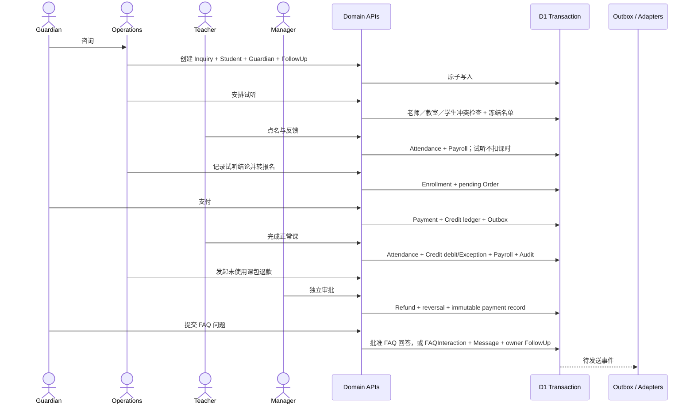

# Austin Education 学生运营系统架构

宽体状态图：[docs/architecture-status.html](./docs/architecture-status.html)

设计目标：在约 1,000 名学生、10 名运营、20 名老师、每周约 60 节课的规模下，把招生、排课、履约、课时、财务、薪资和系统恢复放进一条可审计链路。采用模块化单体；功能已实现到 sandbox 可运行深度，真实支付／银行／消息 provider 仍是外部部署边界。

## 1. 五层架构

每层回答不同问题：

| 层 | 定位 | 关键问题 |
|---|---|---|
| 系统使用者 | 五类真实使用人 | 谁在系统中工作？ |
| 身份与访问控制 | 认证、账号状态、角色、对象范围、应急授权 | 他是谁，能操作什么和谁？ |
| 角色工作台 | 同一业务事实的不同任务视图 | 每个角色如何高效完成工作？ |
| 核心业务 | 生命周期、状态机、账本、审批 | 哪些事实成立，允许怎样变化？ |
| 基础设施 | 持久化和外部 provider | 数据如何保存，外部失败如何隔离？ |

“身份提供方”是负责验证登录身份并签发可信会话的外部服务，例如当前 ChatGPT Identity，未来也可以是 Google、Microsoft 或邮件 OTP。它只回答“你是谁”；本系统自己的账号和授权表回答“你能做什么”。

## 2. 角色与对象授权

| 能力 | 教师 | 运营 | 主管 | 学生 | 家长 | 系统管理员 |
|---|---:|---:|---:|---:|---:|---:|
| 查看课表 | 自己 | 全部／负责范围 | 全部 | 自己 | 关联孩子 | 仅诊断元数据 |
| 查看班级学生 | 任课班 | 运营范围 | 全部 | — | 自己孩子 | 默认无明文业务访问 |
| 点名／课堂反馈 | 任课课次 | — | — | 查看自己 | 查看孩子 | — |
| 咨询／试听／分班 | 查看被分配试听 | 执行 | 全部与例外 | — | 查看自己的安排 | — |
| 下单／支付 | — | 代办 | 查看／审批 | 自己 | 关联孩子 | — |
| 退款 | — | 发起 | 独立审批 | — | 通过运营申请 | — |
| 老师薪资 | 自己只读 | 摘要 | 审批／支付 | — | — | 仅任务健康 |
| 系统任务／集成 | — | — | 设置与审批 | — | — | 诊断、outbox 状态处理、申请支持 |

授权不靠隐藏菜单：动态页面、overview API、command API 和领域对象都会重新检查。Guardian 通过关联表获得多个孩子；运营 owner scope 同时约束行动队列和续费／退款写操作。系统管理员不是永久业务超级用户。即使同一个账号同时持有 Manager 和 System Admin，也不能审批自己的应急权限申请。当前 break-glass 已实现申请／审批模型，但获批 scope 尚未被业务 API 消费，不能声称已经临时放权。

## 3. 共享业务模块

班级与课表不是某个角色的私有模块，而是所有工作台共享的事实：老师看自己的课，学生／家长看自己的课，运营和主管看全局并解决冲突。学生与招生同理，但老师只能看到已经进入自己课次的名单，不看到内部招生漏斗和联系信息。

试听与正常课共用：

- `ClassSeries`：周期规则和默认 `sessionKind`。
- `LessonSession`：某天实际课次和类型快照，可取消、改时或代课。
- `SessionParticipant`：该课次的冻结名单，来源可为 enrollment、trial、makeup 或 manual。
- `Attendance`：实际出勤；试听参与者不扣学生课时。
- `TeacherPayRate`：按老师、课次类型和生效日期决定薪资，试听可有不同费率。

因此没有复制“试听课系统”和“正式课系统”，差异由政策字段表达。

## 4. 关键生命周期

非法逆转由数据库 trigger 拒绝，服务端把已知冲突转换为稳定 409，而不是不透明 500。

## 5. 主要数据关系

Credit balance 是不可变流水之和：purchase `+n`、attendance `-1`、adjustment `±n`、reversal 反向冲销。Payment、Credit、Audit 和 paid Payroll 不直接覆盖历史。

## 6. 完整业务链

## 7. 错误、并发与恢复

| 场景 | 行为 |
|---|---|
| 未登录／账号或机构停用 | 401／403 |
| 角色或对象越权 | 403；不泄露目标明细 |
| 非法字段、非法业务组合 | 422 |
| 旧版本、重复审批、排课冲突 | 409；表单可保留并刷新 |
| 同一课次完成重放 | 相同 key + payload 返回稳定 receipt；跨课次 key 返回 409 |
| 支付 webhook 重放 | provider event 唯一；相同订单返回 idempotent replay |
| 零余额出勤 | 保存 Attendance，不开负账，生成 BillingException |
| 外部消息失败 | 业务事务保留，Outbox 重试；不重复业务写入 |
| LLM 超时／非法结构／敏感内容 | 教师反馈走本地 fallback；FAQ 精确匹配批准条目，否则转人工 |
| FAQ 要求退款、改课、医疗／安全建议 | 不调用自由回答；原子创建 owner 人工任务 |
| 并发穿过应用预检 | DB UNIQUE／trigger 决定单一赢家，映射为业务 409 |

## 8. 当前边界

- 题面是一家机构，旧核心表按单租户工作；新平台表已带组织边界。真正 SaaS 化要给所有旧核心实体增加 `organization_id` 并执行双租户隔离测试。
- Payment 是可执行 sandbox；Bank 只有配置占位，Email／SMS／WeChat 只有 Message／Outbox 模型和配置，尚无发送 adapter。
- 当前只允许未使用课包的全额退款；部分退款和手续费需要产品政策。
- 生产化仍需 webhook 签名、队列 lease/dead-letter、监控、备份恢复和远程 D1 并发压测。
