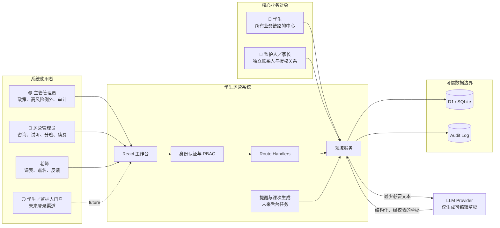
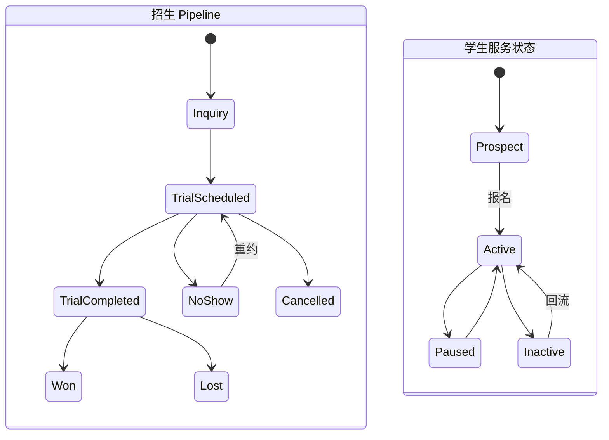
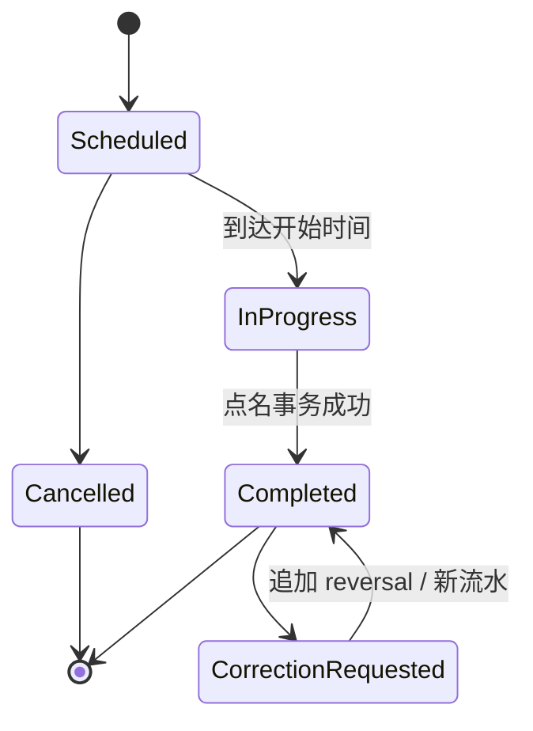
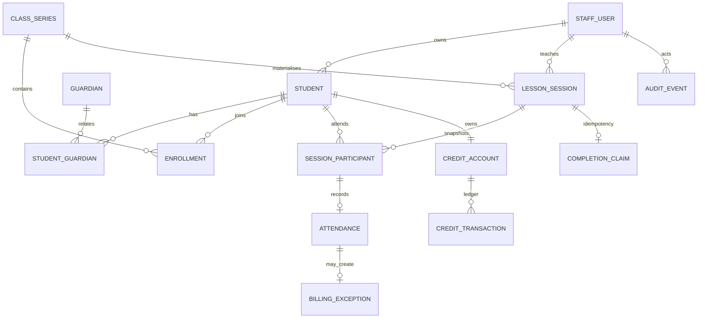
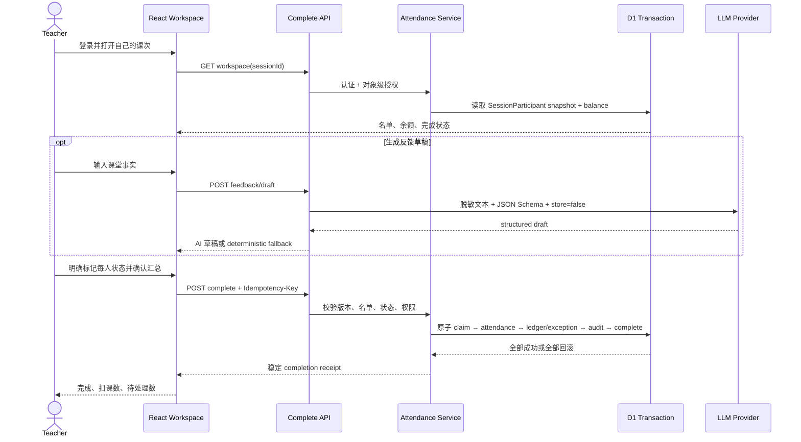

# Austin Education 学生运营系统架构

> 设计目标：在约 1,000 名学生、10 名 Admin、20 名老师、每周约 60 节课的规模下，优先保证业务事实、权限、课时账务和可恢复性。采用模块化单体而不是微服务；设计覆盖完整业务，代码只实现老师点名这一条垂直切片。

### 图例与诚实边界

| 标记 | 含义 |
|---|---|
| 🔵 题面 | 作业背景或评分标准明确给出／明确暗示 |
| 🟣 推导 | 为解决真实业务一致性、职责分离和异常恢复而独立设计 |
| ⚪ 未来 | 合理扩展假设，需要业务方确认，不属于本次代码承诺 |

需求来源与实现状态是两个不同维度。例如“课时与续费”来自题面，但当前只实现了账本和余额异常；“主管管理员”是我们推导的角色，当前只实现了部分高风险 API。

## 1. 系统上下文

### 信任边界

- 浏览器只提交意图，不提交可信的 role、teacherId、余额或扣课数量。
- Route Handler 完成认证与输入解析；领域服务执行授权、状态机和事务。
- 数据库通过 FK、CHECK、UNIQUE 和 trigger 兜底关键不变量。
- LLM 永不决定权限、排课、出勤或计费，也不在数据库事务内。

## 2. 五层定位与模块化单体

| 层 | 功能定位 | 回答的问题 |
|---|---|---|
| ① 系统使用者层 | 老师、运营管理员、主管管理员 | 谁在系统中工作？ |
| ② 交互体验层 | 各角色的任务工作台 | 用户如何高效完成任务？ |
| ③ 应用与安全层 | 登录、权限、命令编排、幂等、错误契约 | 一次操作如何被安全执行？ |
| ④ 领域业务层 | 学生招生、排课、履约、课时、异常、AI 辅助 | 业务事实和规则是什么？ |
| ⑤ 基础设施层 | 数据库、LLM、未来支付／消息 | 数据存在哪里，外部服务如何接入？ |

| 领域模块 | 来源 | 主要职责 | 当前实现 |
|---|---|---|---:|
| 身份与权限 | 🔵 题面 | Staff 身份、角色、停用、对象级权限 | ✅ |
| 招生流程 | 🔵 题面 | 咨询、试听、转化、流失原因 | 设计 |
| 学生与家庭管理 | 🔵 题面暗示 | 学生、监护人、负责人和转交历史 | 部分 |
| 班级与排课 | 🔵 题面 | 固定班、具体课次、代课、取消、冲突 | 部分 |
| 入班与名单 | 🔵＋🟣 | 入班区间、转班、课次名单快照 | ✅ 切片 |
| 教学履约 | 🔵 题面 | 出勤、课堂记录、反馈、纠错 | ✅ 切片 |
| 课时与续费 | 🔵＋🟣 | 购买、消费、流水、低余额、异常 | ✅ 切片 |
| 跟进任务 | 🔵 题面 | 试听跟进、续费任务、SLA、提醒 | 设计 |
| AI 文本辅助 | 🔵 题面 | 结构化草稿、校验、降级、生成审计 | ✅ 切片 |
| 审计与运营恢复 | 🟣 推导 | 操作者、错误码、对账、指标 | 部分 |

模块共享一个关系数据库和一次部署，但通过领域服务边界隔离。当前规模下这比微服务更易保证事务和演示可解释性。

**“学生与家庭管理”为什么位于第四层？**
它不是倒数第二优先级，而是与排课、履约、课时并列的领域模块。上面三层负责“谁来用、如何操作、如何安全编排”；它负责 Student、Guardian、咨询、试听和 Owner 等业务规则；下面的基础设施层才负责真正的数据存储。

## 3. 角色与权限

| 操作 | 老师 | 运营管理员 | 主管管理员 | 未来学生／监护人门户 |
|---|---:|---:|---:|---:|
| 查看自己的今日课次 | 自己 | 只读摘要 | 全部 | — |
| 查看课程名单 | 自己课次 | 负责学生／机构策略 | 全部 | 自己 |
| 完成点名 | 自己课次 | 不允许 | 异常代办 | — |
| 修改已完成点名 | 不允许 | 通过纠错流程 | 通过纠错流程 | — |
| 查看家长付款信息 | 不允许 | 按负责范围 | 全部 | 自己 |
| 安排试听／分班 | 不允许 | 自己负责学生 | 全部 | 申请 |
| 课时购买／调整／退款 | 不允许 | 受限 | 允许并审计 | 查看 |
| 处理零余额异常 | 查看结果 | 处理负责学生 | 处理全部 | 补购 |
| 转移学生负责人 | 不允许 | 申请／受限 | 允许并保留历史 | — |

角色只说明“能做什么”；学生 owner／课次 teacher 说明“能操作哪个对象”。两者必须同时满足。

- **运营管理员**就是“干活的 Admin”：管理自己的学生、咨询、试听、分班、续费和日常异常。
- **主管管理员**可理解为 Manager Admin／Super Admin：处理跨负责人转交、退款、豁免、政策和审计。题面没有明确该角色，它来自职责分离设计，也可以在未来改成 permission scope，而不必永久固化为三个等级。
- **Student 是必不可少的核心实体**；“未来”只修饰学生／监护人登录门户。首版是内部员工系统，因此学生和监护人现在是被管理的业务对象，还不是登录角色。

## 4. 关键生命周期

招生状态和服务状态是两个正交维度，不能压进一个 `student.status`。

- `ClassSeries` 是每周规则；`LessonSession` 是某天实际发生的课。
- 课次形成时冻结 `SessionParticipant`，之后退班不会改写历史名单。
- 已完成出勤不直接 UPDATE；纠错追加冲销和新事实。

## 5. 数据关系

### 课时账本

| 类型 | 数量 | 规则 |
|---|---:|---|
| PURCHASE | `+n` | 购课产生，不覆盖旧余额 |
| ATTENDANCE | `-1` | 由唯一 Attendance source 产生 |
| ADJUSTMENT | `±n` | Manager/Admin，必须有原因 |
| REVERSAL | 与原流水相反 | 引用原流水，不修改或删除历史 |

余额由流水求和。若到课但余额不足，Attendance 仍保存，同时创建 `BillingException(open)`；处理后要么补购并扣课，要么豁免并记录原因。

## 6. 当前垂直切片链路

## 7. 异常与恢复原则

| 场景 | 行为 |
|---|---|
| 未登录／停用账号 | 401／403；前端提供重新登录 |
| 操作其他老师的课 | 403；零写入 |
| 名单变化或旧版本 | 409；保留草稿，刷新对比 |
| 重复请求 | 同 key + 同 payload 返回原 receipt；不同 payload 返回 409 |
| 余额不足 | 出勤保存、不开负账、创建 billing exception |
| 数据库 statement 失败 | 整个 transaction rollback |
| 网络结果未知 | 用同 key 查询／重试并与 receipt 对账 |
| LLM 未配置、超时、429、5xx、非法结构 | 返回本地 fallback，不影响点名 |
| 切换课次／刷新 | dirty guard + 每课次本地草稿恢复 |
| 已取消课次 | UI 只读，服务端 409 |

## 8. 扩展路径

1. **下一业务切片**：Admin 的试听安排与跟进队列。
2. **账务闭环**：购买、退款、课包有效期、BillingException 处理 UI。
3. **排课能力**：周期课生成、节假日、教室／老师／学生冲突和代课。
4. **家长门户**：只读余额、出勤和经审核的反馈。
5. **运营能力**：续费提醒、SLA、审计查询、对账任务和指标告警。
6. **规模变化时**：先加索引、队列和只读副本；只有明确独立扩缩容需求时才拆服务。
