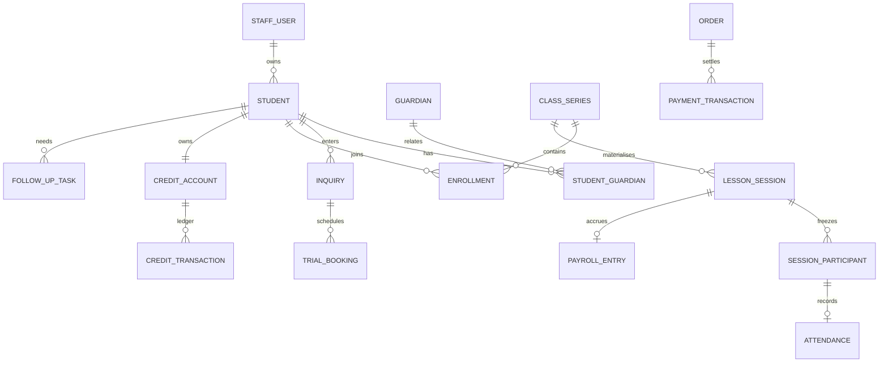

# 学生运营系统设计（Part A）

## 1. 业务理解

系统管理的不是一张学生表，而是持续数年的服务关系：咨询 → 试听 → 报名购课 → 固定班／具体课次 → 出勤与反馈 → 课时消费 → 续费、暂停或流失。

| 角色 | 第一关注点 | 高频操作 |
|---|---|---|
| 运营 Admin | 自己负责的咨询、试听后未跟进、低课时学生、排课风险 | 建咨询、排试听、跟进、转报名、准备续费订单 |
| 教师 | 今天上什么课、名单、新生、课堂记录 | 点名、写反馈、完成课次、查看个人计薪 |
| 主管 Admin | 全局冲突、课时异常、退款、薪资和审计 | 审批退款／薪资／例外，查看全局风险 |
| 学生／监护人 | 自己或关联孩子的课表、出勤、反馈、课时与订单 | 查看、续费、支付、提交问题 |
| 系统管理员 | 集成、任务、outbox 和故障定位 | 诊断、重试技术任务、申请限时支持；不代替业务审批 |

核心判断：Guardian 与 Student 是不同对象；课时具有资金属性；ClassSeries 与一次真实上课不能混为一张表；试听和正式课共用排课／出勤引擎，但计费、转化和薪资策略不同。

## 2. 第一版解决与故意不解决

第一版优先做“运营行动中心”以及它依赖的完整事实链：

1. Admin 登录后第一眼看到“试听完成待跟进”和“余额 ≤ 机构阈值”的本人学生。
2. 可记录试听结果、完成人工跟进、转报名，或为低课时学生准备待支付续费订单。
3. 教师点名、课时账本、支付和退款提供上游／下游真实数据，保证队列不是静态报表。
4. 基础 FAQ 由受控 LLM 分类；只引用批准知识，个案和低置信度问题自动转给学生 owner。

本次故意不做完整生产能力：正式班周期排课 UI、请假／代课／补课、部分退款、家庭共享课包、工资单和银行代发、真实 Email/SMS/WeChat、完整多租户。这些都重要，但不妨碍验证 owner scope、状态机、账本、事务和失败恢复；详见 `ARCHITECTURE.md`。

## 3. 数据模型



| 实体 | 关键字段与关系 |
|---|---|
| Student | `lifecycle_status`, `owner_admin_id`；当前 owner 用于数据范围，生产扩展为带起止时间的 assignment history |
| ClassSeries / LessonSession | Series 是周期计划；Session 是某天实例，保存日期、时间、老师、类型快照和状态，可独立取消／代课 |
| Enrollment / SessionParticipant | Enrollment 表示一段入班关系；Participant 冻结某课次真实名单，退班不能改写历史 |
| Inquiry / TrialBooking / FollowUpTask | 招生阶段、具体试听课、结果与 owner 待办分离，避免一个 `student.status` 承担全部生命周期 |
| CreditAccount / CreditTransaction | 不保存可变余额；购买 `+n`、正式课出勤 `-1`、调整 `±n`、退款／纠错用 reversal；余额为 `SUM(quantity)` |
| Order / Payment / Refund | 订单、渠道事件和退款分别建模；provider event 唯一，退款审批人与申请人分离 |
| FAQInteraction | 保存批准 FAQ 命中或人工转接结果；人工转接同时创建 Message 和 owner FollowUpTask |

## 4. 必须由系统强制的规则

| 规则 | 执行位置 |
|---|---|
| Admin owner scope：运营只能修改自己负责的学生／咨询／任务 | 服务端对象授权；前端隐藏不算权限 |
| 老师、教室、学生的时间区间不得重叠，相邻 `end == start` 允许 | 服务层预检 + 数据库 trigger 防并发穿透 |
| 试听已完成出勤后才能记录 attended/no-show；cancelled/no-show 不能直接 enrol | 领域状态机 |
| 正式生 Present／Late 扣 1；Absent 和试听生不扣 | 服务端计费策略 |
| 余额不足仍保存真实出勤，不允许负账，并创建 BillingException | D1 transaction + trigger |
| 同一支付事件、课次完成和账本 source 只能生效一次 | Idempotency-Key／provider event／UNIQUE |
| 出勤、课时、薪资、审计和完成状态必须全成或全回滚 | D1 batch transaction |
| 退款申请者不能审批自己的退款；paid payroll 不能改写 | 服务层职责分离 + DB 状态机／不可变 trigger |
| FAQ LLM 只能选择批准 FAQ；个人排课、退款、支付争议、医疗／安全问题必须转人工 | 服务端 policy filter + strict structured output + allowlist 校验 |
| AI 不可用、超时或结构非法时，业务仍可继续 | 确定性 FAQ fallback／人工 handoff；教师反馈使用本地 fallback |

## 5. 假设与最想确认的问题

当前假设：业务日期统一为 `Australia/Melbourne`；低课时阈值默认 3 且可由机构设置；一次正常出勤消费 1 课时；试听免费但老师可按试听费率计薪；余额不足不抹掉出勤事实；当前题面是一家机构而非多租户 SaaS；退款首版只支持未消费课包全额退款。

最想向业务方确认：

1. 迟到、请假、no-show、补课分别如何扣课和计薪？
2. 课时属于学生、家庭、课程还是具体课包，是否到期或可转让？
3. 学生转给另一位 Admin 时，历史、开放任务和绩效如何迁移？
4. 部分退款、手续费以及已消费课时的退款如何归因？
5. 家长反馈、消息渠道和 FAQ 人工接管需要怎样的审核、同意与 SLA？

## 6. 页面与信息结构

| 入口 | 第一屏 | 高频操作步数 |
|---|---|---:|
| 运营工作台 | 试听完成待跟进、低课时学生、活跃咨询、今日试听 | 跟进／续费 1–2 步 |
| 教师工作台 | 今天的课与当前名单 | 点名并完成 2 步 |
| 主管管理台 | 冲突、退款、异常、待核薪资 | 审批 1–2 步 |
| 学生／家长门户 | 下一节课、余额、待付订单、关联孩子 | 续费 2 步；FAQ 1 步 |
| 系统运维台 | 失败任务、outbox、异常集成、支持会话 | 诊断／重试 1–2 步 |

核心页面草图：

```text
运营行动中心
┌ 试听完成待跟进 ─────────┐  ┌ 低课时学生（≤3）────────┐
│ Student 28  待记录结果  │  │ Mia       0  [准备续费] │
│ Student 27  待人工跟进  │  │ Noah      1  [准备续费] │
└ [记录结果] [完成跟进] ──┘  └ Ethan     3  [准备续费] ┘
下方：咨询漏斗｜全局课表｜全部任务｜学生与课时｜排课资源
```

```text
学生／家长门户
下一节课｜剩余课时｜出勤反馈｜待付订单
[创建续费订单] [支付]
FAQ：输入问题 → 批准 FAQ 回答，或“已转负责运营（ticket id）”
```

所有工作台都有 loading、empty、403／会话过期、网络失败重试和成功反馈；高风险操作需要明确确认或服务端状态机。

## 7. Part B 选择理由

主 Demo 选择 Admin 的“试听完成未跟进 + 低课时学生”行动中心，因为它直接对应题面两个高频事故，能在一个克制页面内同时验证 owner 权限、跨模块查询、试听状态机、课时账本、真实写操作、错误恢复和人工接管。它不是只能看的 dashboard：Admin 能完成跟进、记录试听结论、转报名和创建续费订单。

教师履约是支撑该切片的数据真实性链路：老师完成课次后产生出勤、课时、异常和薪资。LLM 放在两处真正省人力的位置：教师反馈草稿，以及受批准知识库约束的 FAQ 分流；两者失败都不会阻断核心业务。
